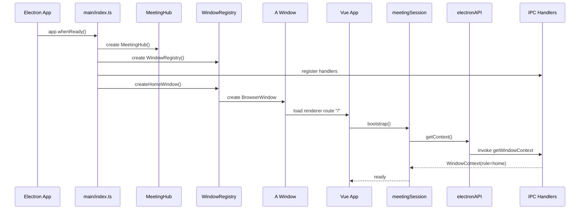
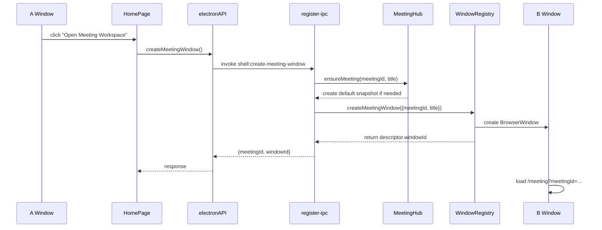
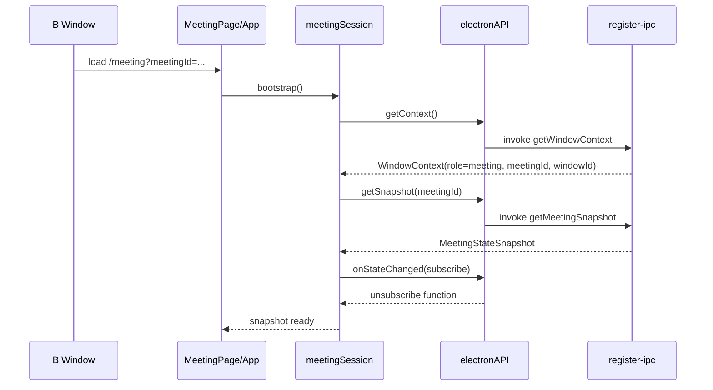
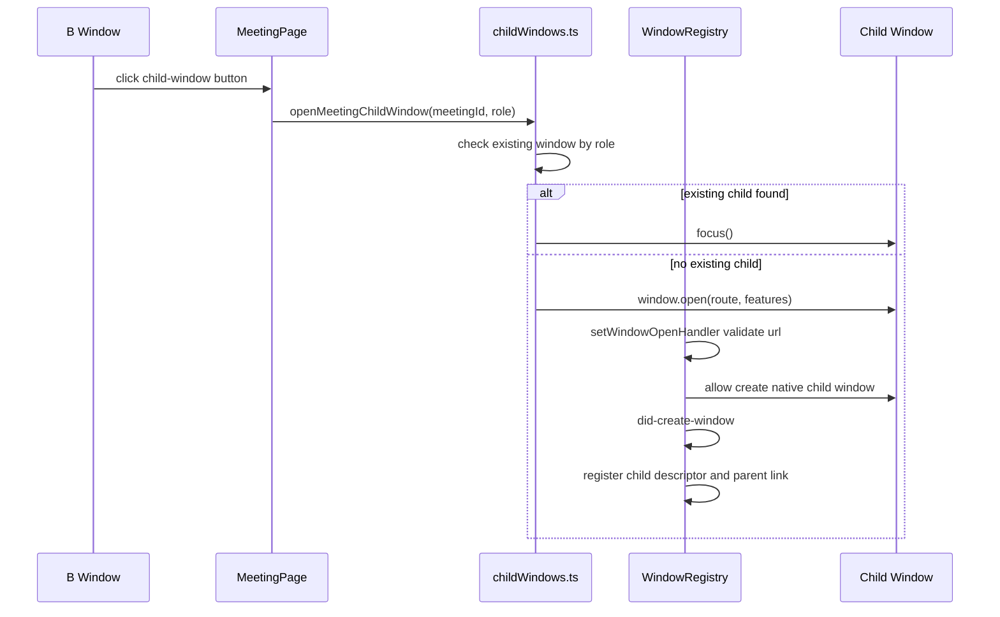
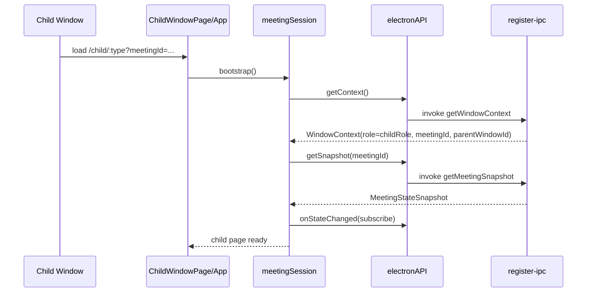
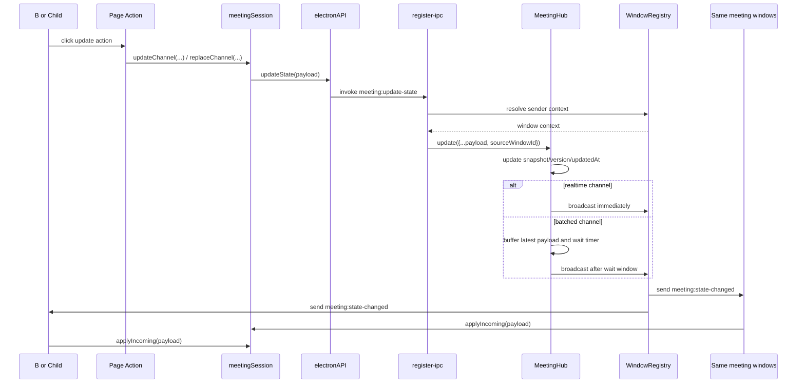
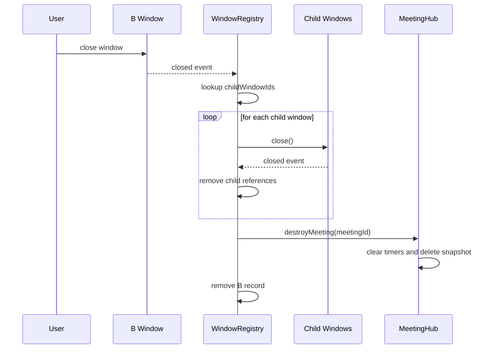

# 核心时序图说明

这份文档专门回答一个问题：

“这个项目里，某个动作发生时，A 窗口、B 窗口、子窗口、preload、main process、状态中心，到底是谁先调谁？”

如果你已经知道文件结构，但还不够确定运行顺序，就看这份文档。

## 参与者说明

为了让时序图可读，先统一一下参与者名字：

- `A`：大厅窗口
- `B`：会议根窗口
- `Child`：会议子窗口
- `Renderer`：Vue 页面层
- `Store`：`meetingSession.ts`
- `Preload`：`window.electronAPI`
- `IPC`：主进程注册的 IPC handler
- `Registry`：`WindowRegistry`
- `Hub`：`MeetingHub`

## 时序一：应用启动并打开大厅窗口

涉及文件：

- [electron/main/index.ts](/Users/m/工作/electron/electron/main/index.ts)
- [window-registry.ts](/Users/m/工作/electron/electron/main/services/window-registry.ts)
- [src/renderer/src/main.ts](/Users/m/工作/electron/src/renderer/src/main.ts)
- [src/renderer/src/App.vue](/Users/m/工作/electron/src/renderer/src/App.vue)

### Mermaid

### 纯文本顺序

1. Electron 主进程进入 `whenReady`。
2. 主进程创建 `MeetingHub`。
3. 主进程创建 `WindowRegistry`。
4. 主进程注册 IPC handler。
5. 主进程调用 `createHomeWindow()`。
6. `WindowRegistry` 创建大厅窗口。
7. 大厅窗口加载 `/` 路由。
8. 渲染层 Vue 启动。
9. `App.vue` 调用 `meetingSession.bootstrap()`。
10. store 通过 preload 请求窗口上下文。
11. 主进程返回当前窗口是 `home`。
12. 因为大厅页没有 `meetingId`，所以不会去拉会议快照。

为什么这样设计：

- 启动时必须先知道“当前窗口是谁”，再决定要不要拿会议状态。
- 大厅页不属于任何会议域，所以它的 bootstrap 比会议页更轻。

## 时序二：从大厅窗口打开一个会议根窗口

涉及文件：

- [HomePage.vue](/Users/m/工作/electron/src/renderer/src/pages/HomePage.vue)
- [preload/index.ts](/Users/m/工作/electron/electron/preload/index.ts)
- [register-ipc.ts](/Users/m/工作/electron/electron/main/ipc/register-ipc.ts)
- [meeting-hub.ts](/Users/m/工作/electron/electron/main/services/meeting-hub.ts)
- [window-registry.ts](/Users/m/工作/electron/electron/main/services/window-registry.ts)

### Mermaid

### 纯文本顺序

1. 用户在大厅页点击打开会议按钮。
2. `HomePage.vue` 调用 `window.electronAPI.shell.createMeetingWindow()`。
3. preload 通过 IPC 请求主进程。
4. IPC handler 生成或确认 `meetingId`。
5. `MeetingHub.ensureMeeting()` 创建这场会议的默认快照。
6. `WindowRegistry.createMeetingWindow()` 创建 `B` 窗口。
7. 主进程把 `meetingId` 和 `windowId` 返回给大厅页。
8. 新的 `B` 窗口加载会议路由。

为什么这样设计：

- 先建会议状态，再建会议窗口，保证新窗口一启动就有快照可读。
- 创建会议窗口这件事必须由主进程掌控，渲染层不能自己 new BrowserWindow。

## 时序三：会议根窗口启动并完成冷启动

涉及文件：

- [App.vue](/Users/m/工作/electron/src/renderer/src/App.vue)
- [meetingSession.ts](/Users/m/工作/electron/src/renderer/src/stores/meetingSession.ts)
- [register-ipc.ts](/Users/m/工作/electron/electron/main/ipc/register-ipc.ts)

### Mermaid

### 纯文本顺序

1. `B` 窗口加载会议页面。
2. 根组件触发 `meetingSession.bootstrap()`。
3. store 先获取自己的窗口上下文。
4. 得到 `meetingId` 后，再请求会议快照。
5. 拿到快照后，订阅后续状态广播。
6. 页面开始基于 `snapshot` 渲染会议内容。

为什么这样设计：

- 如果先订阅、后拉快照，页面会短暂处于无基准状态。
- 先拿快照再订阅，更符合“先同步当前值，再听增量变化”的思路。

## 时序四：B 窗口打开子窗口

涉及文件：

- [MeetingPage.vue](/Users/m/工作/electron/src/renderer/src/pages/MeetingPage.vue)
- [childWindows.ts](/Users/m/工作/electron/src/renderer/src/utils/childWindows.ts)
- [window-registry.ts](/Users/m/工作/electron/electron/main/services/window-registry.ts)

### Mermaid

### 纯文本顺序

1. 用户点击某个子窗口按钮。
2. 页面调用 `openMeetingChildWindow(meetingId, role)`。
3. 工具函数先看这个角色是否已经打开。
4. 如果已经打开，就直接聚焦已有窗口。
5. 如果还没打开，就执行 `window.open(...)`。
6. 主进程拦截这次打开请求。
7. 主进程校验路由是否合法、角色是否合法、会议 ID 是否匹配。
8. 主进程允许创建，并在 `did-create-window` 阶段登记子窗口。
9. 子窗口与 `B` 窗口建立父子关系。

为什么这样设计：

- 同角色子窗口单例化，避免一个会议里出现多个 chat 或多个 roster。
- 子窗口是否合法必须由主进程判断，不能信任渲染层路由字符串。

## 时序五：子窗口启动并加入同一会议域

涉及文件：

- [ChildWindowPage.vue](/Users/m/工作/electron/src/renderer/src/pages/ChildWindowPage.vue)
- [meetingSession.ts](/Users/m/工作/electron/src/renderer/src/stores/meetingSession.ts)

### Mermaid

### 纯文本顺序

1. 子窗口加载自己的页面路由。
2. 它和 `B` 窗口一样执行 bootstrap。
3. 主进程返回它的角色、会议 ID、父窗口 ID。
4. 子窗口拉取同一份会议快照。
5. 子窗口开始监听同一会议域的状态广播。

为什么这样设计：

- 子窗口虽然是独立原生窗口，但它不是独立会议。
- 它必须接入和 `B` 窗口相同的会议域。

## 时序六：任意窗口更新共享状态

涉及文件：

- [meetingSession.ts](/Users/m/工作/electron/src/renderer/src/stores/meetingSession.ts)
- [preload/index.ts](/Users/m/工作/electron/electron/preload/index.ts)
- [register-ipc.ts](/Users/m/工作/electron/electron/main/ipc/register-ipc.ts)
- [meeting-hub.ts](/Users/m/工作/electron/electron/main/services/meeting-hub.ts)
- [window-registry.ts](/Users/m/工作/electron/electron/main/services/window-registry.ts)

### Mermaid

### 纯文本顺序

1. 页面上的某个按钮触发更新动作。
2. 页面调用 store 的 `updateChannel` 或 `replaceChannel`。
3. store 通过 preload 把请求发给主进程。
4. 主进程根据 sender 找到真实窗口上下文。
5. 主进程补上 `sourceWindowId`。
6. `MeetingHub` 更新会议快照、版本号和更新时间。
7. 如果频道是实时同步，就立即广播。
8. 如果频道是批量同步，就缓存短时间内最后一次结果，再统一广播。
9. 同一 `meetingId` 下的全部窗口收到广播。
10. 每个窗口本地的 store 用 `applyIncoming` 更新自己的快照副本。

为什么这样设计：

- 渲染层负责发意图，主进程负责定稿。
- 广播的是“最终频道值”，不是“某次操作命令”，这样窗口更容易保持一致。

## 时序七：B 窗口关闭，整场会议销毁

涉及文件：

- [window-registry.ts](/Users/m/工作/electron/electron/main/services/window-registry.ts)
- [meeting-hub.ts](/Users/m/工作/electron/electron/main/services/meeting-hub.ts)

### Mermaid

### 纯文本顺序

1. 用户关闭会议根窗口。
2. 主进程收到该窗口的 `closed` 事件。
3. `WindowRegistry` 找到这场会议下登记的全部子窗口 ID。
4. 主进程逐个关闭这些子窗口。
5. 每个子窗口关闭时，再从父窗口引用集合中移除自己。
6. 会议根窗口清理完子窗口后，通知 `MeetingHub.destroyMeeting(meetingId)`。
7. `MeetingHub` 清理这场会议的快照、待广播数据和定时器。
8. 主进程删除会议根窗口记录。

为什么这样设计：

- `B` 窗口是会议生命周期锚点。
- 子窗口不能在父会议结束后继续存活。
- 主进程中的会议状态也不能无限残留。

## 时序八：频道同步策略差异

这不是某个页面流程，而是 `MeetingHub` 内部的两种分支。

### 实时频道

例如：

- `layout`
- `config`
- `handRaise`

顺序：

1. 收到更新请求
2. 更新快照
3. 立即广播

为什么：

- 这些状态对协作时效要求更高

### 批量频道

例如：

- `members`
- `chat`
- `shared`

顺序：

1. 收到更新请求
2. 更新快照
3. 把当前频道最新值写入 `pending`
4. 如果定时器还没启动，则启动定时器
5. 时间窗口结束后只广播最后一次值

为什么：

- 高频频道若每次都广播，会增加无意义刷新和窗口噪音
- 对这个脚手架来说，短时间内只保留最后一版结果更实用

## 最值得记住的主线

如果你只记一条主线，就记下面这句：

> 页面负责发起动作，preload 负责桥接，主进程负责裁决，MeetingHub 负责状态，WindowRegistry 负责窗口，最后再广播回所有同会议窗口。

把这句理解透，这个项目的绝大多数代码都能顺下来。
